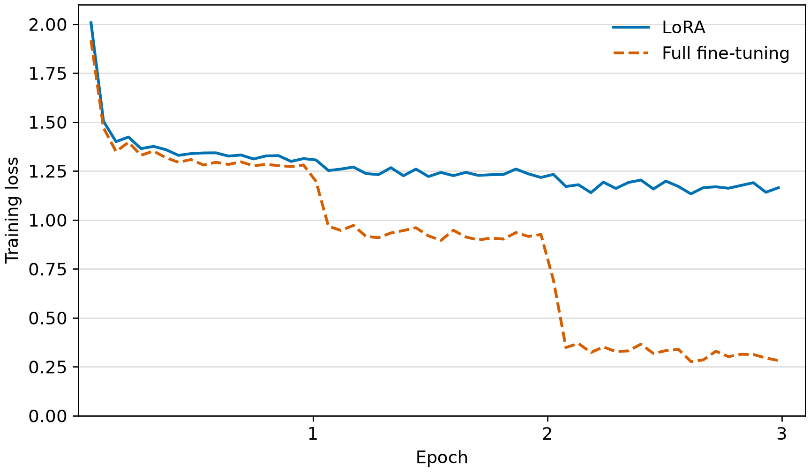
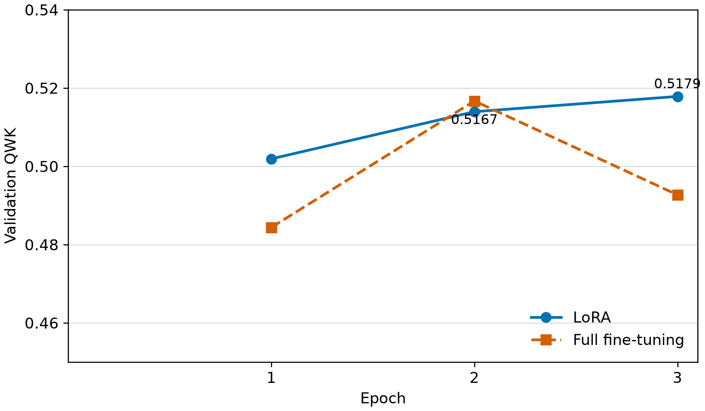

# 4. 結果

　本章では，WRIME Ver.2の公式テスト分割2,500件に対する分類性能と，LoRAおよびフルファインチューニングの学習コストを示す。ファインチューニングでは，各エポック終了時の検証QWKが最大のチェックポイントを用いてテスト分割を評価した。

## 4.1 分類性能の比較

　表2に各手法のテスト分割における分類性能を示す。LoRAのQWKは0.5321，Accuracyは40.68%，MAEは0.7668であった。フルファインチューニングのQWKは0.5267，Accuracyは39.40%，MAEは0.8016であった。今回の実行では，LoRAのQWKが0.0054，Accuracyが1.28ポイント高く，MAEが0.0348低かった。ゼロショットのQWKは0.0004，Accuracyは10.12%，MAEは2.3144であった。

**表2　テスト分割における分類性能（各2,500件）**

| 手法 | QWK | Accuracy | MAE |
|---|---:|---:|---:|
| ゼロショット | 0.0004 | 10.12% | 2.3144 |
| LoRAファインチューニング | 0.5321 | 40.68% | 0.7668 |
| フルファインチューニング | 0.5267 | 39.40% | 0.8016 |

　ゼロショットの予測2,500件のうち，2,496件が「−2」であり，「−1」と「0」は0件，「+1」は1件，「+2」は3件であった。指定した5種類以外の出力は0件であった。この予測分布と併せてみると，ゼロショットの低い評価値は，予測が「−2」に極端に集中した結果である。ただし，ゼロショットでは指示調整済みの`google/gemma-3-270m-it`，二つのファインチューニングでは事前学習済みの`google/gemma-3-270m`を使用しており，表2の差には初期モデルの違いも含まれる。

　図1に，二つのファインチューニング手法の学習損失を示す。学習損失は50ステップごとの記録であり，両手法とも学習の進行に伴って低下した。フルファインチューニングでは，第2エポックから第3エポックにかけても学習損失が低下した。

**図1　学習損失の推移**

　図2に，各エポック終了時の検証QWKを示す。LoRAは第1エポックの0.5019から第3エポックの0.5179まで上昇し，第3エポックが最良であった。フルファインチューニングは第2エポックで最大の0.5167となり，第3エポックには0.4927へ低下した。したがって，テスト評価にはそれぞれ第3エポックと第2エポックのチェックポイントを用いた。

**図2　各エポック終了時の検証QWKの推移**

## 4.2 学習コストの比較

　表3に学習コストを示す。LoRAの学習可能パラメータ数は371,840であり，フルファインチューニングの268,101,376の0.139%であった。3エポックの`Trainer.train()`実行時間はLoRAが740.39秒（12.34分），フルファインチューニングが1,135.64秒（18.93分）であり，LoRAの方が395.26秒（34.8%）短かった。学習中の最大GPU割当メモリはLoRAが5.29 GiB，フルファインチューニングが9.59 GiBであり，LoRAの方が4.30 GiB（44.8%）少なかった。

**表3　ファインチューニングの学習コスト**

| 手法 | 学習可能パラメータ数 | `Trainer.train()`実行時間 | 最大GPU割当メモリ |
|---|---:|---:|---:|
| LoRAファインチューニング | 371,840 | 740.39秒（12.34分） | 5.29 GiB |
| フルファインチューニング | 268,101,376 | 1,135.64秒（18.93分） | 9.59 GiB |

　両手法の学習はそれぞれNVIDIA T4 GPU上で実行した。実行時間はTransformersの`train_runtime`であり，学習と各エポックの検証に加え，チェックポイント保存と最良チェックポイントの復元に要した時間を含む。モデル読み込み，データ取得・前処理，`Trainer.train()`終了後のモデル保存およびテスト評価は含まない。最大GPU割当メモリも`Trainer.train()`の開始直前から終了直後までのPyTorchの計測値であり，GPU全体の使用量ではない。

　ゼロショットには追加学習がないため，学習可能パラメータ数と学習時間は0であり，学習時のGPUメモリは該当しない。
